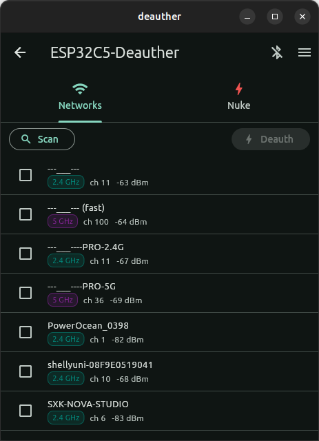
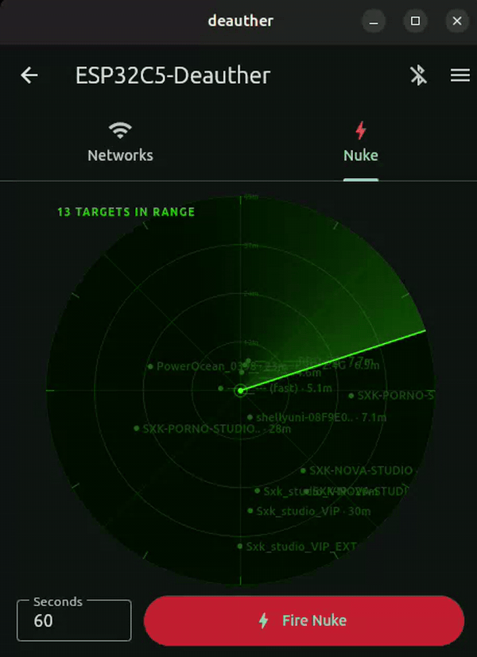

# 5G Deauther — Dual-Band Wi-Fi Deauthentication Toolkit

<p align="center">
  
</p>

ESP32-C5 firmware that scans 2.4 GHz and 5 GHz access points and lets a
controller (mobile, desktop, or watch) send 802.11 deauthentication frames
to selected targets over a Bluetooth LE link. Three controller front-ends
are included in this repo:

| Front-end | Path | Notes |
|-----------|------|-------|
| ESP32-C5 firmware | `esp32-c5/` | The radio. ESP-IDF project for the Seeed XIAO ESP32-C5. |
| Flutter app | `flutter/` | Android / Linux desktop. Full-featured (whitelist, blacklist, nuke, console). |
| Garmin watch app | `garmin/` | Connect IQ app for the Fenix 7 series. Minimal: scan → list networks → deauth. |

The radio and the controllers speak the Nordic UART Service (NUS) BLE
profile with a simple line-buffered text protocol. See
`esp32-c5/README.md` for the protocol reference.

## Screenshots & demos

| Networks panel | Nuke demo |
|----------------|-----------|
|  |  |

The Networks panel sorts scanned APs by band and signal, and lets you
tick individual targets before pressing **Deauth**. The Nuke tab clip
shows the radar view that drives every visible AP simultaneously for a
chosen duration.

---

## ⚠️  Ethical use only

This project is published for **defensive security research and
education** — penetration testing on networks you own or have explicit
written permission to assess, security training, capture-the-flag
exercises, lab demonstrations of Wi-Fi protocol weaknesses, and academic
study.

Using deauthentication frames against networks you do not own or do not
have explicit permission to test is **illegal in most jurisdictions**.
Examples that are NOT covered by this license:

- Interfering with a neighbor's, employer's, café's, school's, or
  airport's Wi-Fi
- Disrupting other people's video calls, smart-home devices, or IoT
  equipment
- Mass denial-of-service against arbitrary access points
- Bypassing captive portals or evading paid Wi-Fi access controls

If you would not be comfortable showing the network owner exactly what
you are doing, **do not run this firmware against that network**.

You are solely responsible for your use of this software. By building,
flashing, or running it you accept that responsibility.

---

## Downloads

Pre-built binaries are published on the
[**Releases**](https://github.com/maxbrito500/esp32-c5-deauth/releases)
page for every tagged version. No toolchain required:

| File | Use it for |
|------|-----------|
| `esp32c5-deauther-firmware.zip` | ESP32-C5 firmware bundle. Unzip and flash with [esptool-js (web)](https://espressif.github.io/esptool-js/) or `esptool` — instructions inside the zip. |
| `deauther-android.apk` | Android phones — single APK that runs on all CPU architectures (arm64, armv7, x86_64). |
| `deauther-linux-x64.tar.gz` | Linux desktop. Extract and run `./deauther`. |
| `SHA256SUMS` | Checksums to verify the downloads |

The Garmin watch app is not currently in the release bundle — it has to
be built locally because Connect IQ apps are signed with a per-developer
key (see `garmin/run-fenix7pro.sh`).

---

## Hardware

- **Seeed Studio XIAO ESP32-C5** — see `specs.md`. Other ESP32-C5 boards
  should work; only the on-board LED GPIO would need adjustment in
  `esp32-c5/main/led.c`.
- USB-C cable (data, not charge-only) for flashing.
- (Optional) Garmin Fenix 7 family watch.

## Build from source (Ubuntu 22.04 / 24.04)

Tested on a clean Ubuntu install. Each component can be built
independently — install only the toolchain you need.

### ESP32-C5 firmware

```sh
# 1. System packages required by ESP-IDF.
sudo apt-get update
sudo apt-get install -y \
    git wget flex bison gperf python3 python3-venv python3-pip \
    cmake ninja-build ccache dfu-util libusb-1.0-0 \
    libffi-dev libssl-dev

# 2. Clone ESP-IDF v5.5.1 (matches the patched libnet80211.a).
mkdir -p ~/esp && cd ~/esp
git clone -b v5.5.1 --recursive https://github.com/espressif/esp-idf.git
cd esp-idf
./install.sh esp32c5            # downloads RISC-V toolchain + tools

# 3. Activate the toolchain in your current shell.
. ~/esp/esp-idf/export.sh        # add this to ~/.bashrc to make it permanent

# 4. Apply the wifi patch and build.
cd /path/to/this/repo/esp32-c5
cp patched_libnet/libnet80211.a "$IDF_PATH/components/esp_wifi/lib/esp32c5/"
idf.py set-target esp32c5
idf.py build

# 5. Flash via USB-C JTAG (no BOOT/RESET button presses needed).
./flash.sh
```

The patched `libnet80211.a` makes `esp_wifi_80211_tx()` accept
management frames with a spoofed source address — required for
deauthentication on the C5's 5 GHz radio. The original library is kept
as `libnet80211.a.orig` after the first patch.

### Flutter — Android APK

```sh
# 1. JDK 17.
sudo apt-get install -y openjdk-17-jdk

# 2. Flutter SDK (stable channel).
git clone -b stable --depth 1 https://github.com/flutter/flutter.git ~/flutter
echo 'export PATH="$HOME/flutter/bin:$PATH"' >> ~/.bashrc
export PATH="$HOME/flutter/bin:$PATH"

# 3. Android command-line tools — point Flutter at your Android SDK
#    (Android Studio installs this; otherwise grab "command-line tools
#    only" from https://developer.android.com/studio and unzip into
#    ~/Android/Sdk/cmdline-tools/latest/, then accept licenses).
flutter doctor --android-licenses
flutter doctor                      # should be all green for Android

# 4. Build a universal APK that runs on every CPU architecture.
cd /path/to/this/repo/flutter
flutter pub get
flutter build apk --release
ls build/app/outputs/flutter-apk/app-release.apk
```

Install on a phone with `adb install` (USB debugging enabled) or by
copying the `.apk` to the phone and tapping it.

### Flutter — Linux desktop

```sh
# 1. GTK and build tools.
sudo apt-get install -y \
    clang cmake ninja-build pkg-config libgtk-3-dev liblzma-dev \
    libsecret-1-dev libjsoncpp-dev

# 2. Flutter SDK (same as above).
flutter config --enable-linux-desktop

# 3. Build and run.
cd /path/to/this/repo/flutter
flutter pub get
flutter run -d linux                 # or: flutter build linux --release
```

### Garmin watch app

The Garmin SDK requires a (free) developer account — see
[`garmin/`](garmin/) for the build scripts (`run-fenix7pro.sh`,
`sideload.sh`).

---

## On-device LED indicator

The yellow user LED on the XIAO ESP32-C5 (GPIO 27, active-low) signals
state via blink rhythm — single-color hardware doesn't allow color
coding:

| State | Pattern |
|-------|---------|
| Idle (no BLE client) | one short flash every 5 seconds |
| BLE client connected | two short flashes every 5 seconds |
| Attack running | continuous rapid strobe (~6 Hz) |

The separate red **C** LED on the board lights up only when the device
is running on battery — that's a hardware indicator, not controlled by
the firmware.

---

## Repository layout

```
.
├── esp32-c5/        # ESP-IDF firmware (NimBLE + dual-band scanner + deauth engine)
├── flutter/         # Cross-platform controller app (BLE + HTTP API)
├── garmin/          # Connect IQ watch app (Monkey C)
├── inspirations/    # Reference implementations from related projects
├── specs.md         # XIAO ESP32-C5 hardware reference
├── LICENSE          # Apache 2.0
└── NOTICE           # Third-party attributions
```

---

## Credits

This project began as a re-architecture of
[**AnvilBrain/esp32-c5-dualband-deauther**](https://github.com/AnvilBrain/esp32-c5-dualband-deauther),
which proved that the ESP32-C5's 5 GHz radio could be coerced into sending
spoofed-SA management frames. Thanks to AnvilBrain for publishing that
work and the libnet80211.a patch that makes 5 GHz deauth possible on
this chip. The original project is MIT-licensed.

This repo is licensed under **Apache 2.0** (see [`LICENSE`](LICENSE) and
[`NOTICE`](NOTICE)).
